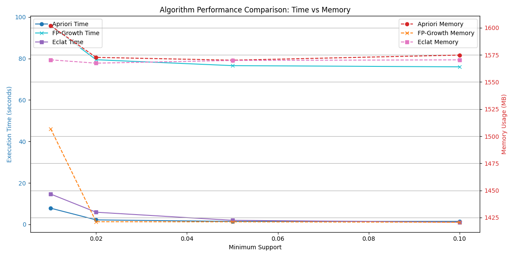
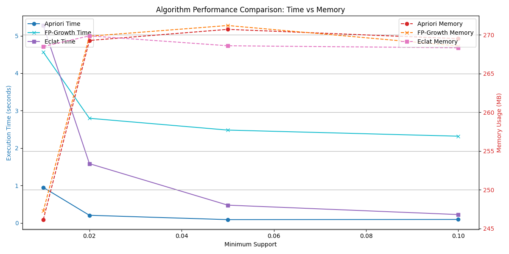
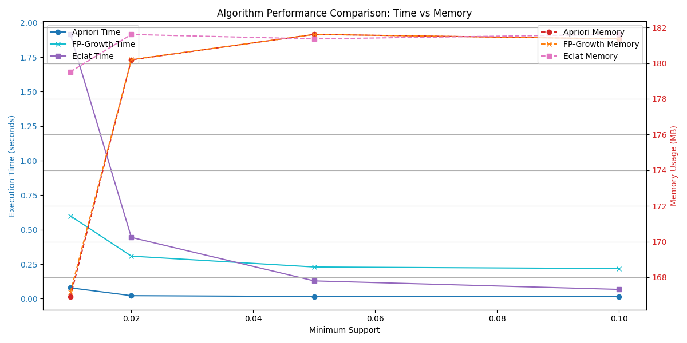

# هدف پروژه

در این پروژه، سه الگوریتم کاوش مجموعه اقلام مکرر شامل Apriori، FP-growth، و Eclat به زبان پایتون پیاده‌سازی و ارزیابی شده است. هدف اصلی بررسی عملکرد این الگوریتم‌ها در شرایط مختلف و انتخاب بهترین الگوریتم برای کاربردهای خاص بر اساس زمان اجرا، استفاده از حافظه، و شرایط داده‌ها است.

---
---


# پیاده‌سازی الگوریتم‌ها و توضیح نحوه کارکرد آن‌ها

در این بخش، سه الگوریتم Apriori، FP-Growth و Eclat را به همراه پیاده‌سازی و نحوه کارکرد آن‌ها توضیح می‌دهیم. این الگوریتم‌ها برای کشف مجموعه اقلام مکرر از داده‌های تراکنشی استفاده می‌شوند. هر یک از این الگوریتم‌ها مزایا و محدودیت‌های خود را دارد که در ادامه  بررسی می‌شوند.

---

## 1. الگوریتم Apriori

### نحوه کارکرد
الگوریتم Apriori یکی از الگوریتم‌های پایه در کشف مجموعه اقلام مکرر است. این الگوریتم به صورت بازگشتی عمل می‌کند و از ویژگی «خاصیت نزولی» استفاده می‌کند، به این معنا که اگر یک مجموعه اقلام زیرمجموعه مکرر نباشد، هیچ‌یک از ابرمجموعه‌های آن نیز مکرر نخواهند بود.

#### مراحل اصلی:
1. یافتن اقلام تکی که پشتیبان آن‌ها از حداقل مقدار تعیین‌شده بیشتر است.
2. تولید مجموعه اقلام کاندیدای جدید با ترکیب اقلام مکرر از مرحله قبل.
3. شمارش پشتیبان مجموعه اقلام کاندیدا و حفظ مجموعه‌هایی که پشتیبان کافی دارند.
4. تکرار مراحل ۲ و ۳ تا زمانی که مجموعه اقلام جدید تولید نشود.

---
---

## ۲. الگوریتم FP-Growth

### نحوه کارکرد

الگوریتم FP-Growth (Frequent Pattern Growth) از ساختار داده‌ای به نام FP-Tree استفاده می‌کند. این درخت داده‌ها را به صورت فشرده ذخیره کرده و از شمارش‌های مکرر جلوگیری می‌کند. برخلاف Apriori، این الگوریتم نیازی به تولید مجموعه اقلام کاندیدای جدید در هر مرحله ندارد.

#### مراحل اصلی:
1. **ساخت درخت FP-Tree:** داده‌ها به صورت فشرده و بهینه در یک درخت ذخیره می‌شوند.
2. **استخراج الگوهای مکرر:** از پایین به بالا، الگوهای مکرر با استفاده از مسیرهای درخت شناسایی می‌شوند.


---
---


## ۳. الگوریتم Eclat

### نحوه کارکرد
الگوریتم Eclat (Equivalence Class Clustering and Bottom-Up Lattice Traversal) از نمایش عمودی داده‌ها استفاده می‌کند. در این نمایش، به جای ذخیره داده‌ها به صورت تراکنش، اقلام و شناسه تراکنش‌های مرتبط با آن‌ها نگهداری می‌شوند. سپس از اشتراک مجموعه شناسه‌ها (TID Sets) برای شناسایی اقلام مکرر استفاده می‌شود.

#### مراحل اصلی:
1. **نمایش عمودی داده‌ها:** هر قلم به همراه فهرست شناسه‌های تراکنش‌هایی که در آن‌ها ظاهر شده‌اند، ذخیره می‌شود.
2. **استخراج الگوهای مکرر:** با استفاده از اشتراک مجموعه شناسه‌ها، پشتیبان محاسبه شده و الگوهای مکرر شناسایی می‌شوند.


# پیاده سازی با پایتون


**پیش‌نیازها و نصب کتابخانه‌ها:**

برای اجرای کد، نیاز به کتابخانه‌های زیر داریم:
- `numpy`: برای عملیات عددی و آرایه‌های چندبعدی.
- `pandas`: برای پردازش و تحلیل داده‌های جدولی.
- `mlxtend`: برای پیاده‌سازی الگوریتم‌های Apriori و FP-growth.
- `matplotlib`: برای مصورسازی نتایج.
- `psutil`: برای اندازه‌گیری میزان حافظه استفاده شده.

کد زیر به طور خودکار کتابخانه‌های موردنیاز را نصب می‌کند:
```python
import subprocess
import sys

def install(package):
    subprocess.check_call([sys.executable, "-m", "pip", "install", package])

required_packages = ["numpy", "pandas", "mlxtend", "matplotlib", "psutil"]
for package in required_packages:
    try:
        __import__(package)
    except ImportError:
        print(f"{package} is not installed. Installing...")
        install(package)
```

---

**توضیح نوع داده‌ها:**

داده‌های مورد استفاده از مجموعه داده “Retail” در آدرس زیر دریافت می‌شوند:
[http://fimi.uantwerpen.be/data/retail.dat](http://fimi.uantwerpen.be/data/retail.dat)

این داده‌ها شامل تراکنش‌هایی واقعی هستند که هر خط نمایانگر یک تراکنش است و اقلام خریداری شده در آن تراکنش با فاصله از هم جدا شده‌اند. به عنوان مثال:
```
1 2 3
1 2
3 4 5
```
در این داده‌ها، آیتم‌ها اعداد هستند که به صورت لیستی از تراکنش‌ها پردازش می‌شوند.

---

**بخش اول: آماده‌سازی داده‌ها**

ابتدا داده‌ها از فایل `retail.dat` بارگذاری و پردازش می‌شوند. برای این منظور از کلاس `TransactionEncoder` کتابخانه `mlxtend` استفاده شده است:
```python
from mlxtend.preprocessing import TransactionEncoder

def load_and_prepare_data():
    import os
    import urllib.request

    # مسیر فایل داده
    current_dir = os.path.dirname(os.path.abspath(__file__))
    file_path = os.path.join(current_dir, "retail.dat")

    # دانلود فایل در صورت عدم وجود
    if not os.path.exists(file_path):
        url = "http://fimi.uantwerpen.be/data/retail.dat"
        urllib.request.urlretrieve(url, file_path)

    # خواندن فایل
    with open(file_path, "r") as f:
        dataset = [line.strip().split() for line in f.readlines()]

    # تبدیل داده‌ها به فرمت باینری
    te = TransactionEncoder()
    te_data = te.fit(dataset).transform(dataset)
    data = pd.DataFrame(te_data, columns=te.columns_).astype(bool)
    return data
```

---

**بخش دوم: پیاده‌سازی الگوریتم‌ها**

### 1. الگوریتم Apriori
این الگوریتم از ترکیب اقلام برای شناسایی الگوهای مکرر استفاده می‌کند.
```python
from mlxtend.frequent_patterns import apriori

def run_apriori(data, min_support):
    start_time = time.time()
    frequent_itemsets = apriori(data, min_support=min_support, use_colnames=True)
    end_time = time.time()
    return frequent_itemsets, end_time - start_time
```

### 2. الگوریتم FP-Growth
این الگوریتم برای شناسایی الگوهای مکرر از ساختار درختی استفاده می‌کند.
```python
from mlxtend.frequent_patterns import fpgrowth

def run_fpgrowth(data, min_support):
    start_time = time.time()
    frequent_itemsets = fpgrowth(data, min_support=min_support, use_colnames=True)
    end_time = time.time()
    return frequent_itemsets, end_time - start_time
```

### 3. الگوریتم Eclat
این الگوریتم با استفاده از نمایه‌سازی عمودی اقلام عمل می‌کند.
```python
def eclat(data, min_support):
    vertical_data = {item: set(data.index[data[item]]) for item in data.columns}
    frequent_itemsets = {}

    def explore(items, prefix=[]):
        for item, tids in items.items():
            if len(tids) >= min_support:
                new_prefix = prefix + [item]
                frequent_itemsets[tuple(new_prefix)] = len(tids)
                new_items = {key: tids.intersection(value) for key, value in items.items() if key != item}
                explore(new_items, new_prefix)

    start_time = time.time()
    explore(vertical_data)
    end_time = time.time()
    return frequent_itemsets, end_time - start_time
```

---

**بخش سوم: مقایسه عملکرد الگوریتم‌ها**

برای مقایسه عملکرد الگوریتم‌ها، زمان اجرا و حافظه مصرفی اندازه‌گیری شده است:
```python
def compare_algorithms(data, min_supports):
    results = []

    for min_support in min_supports:
        print(f"\nEvaluating for min_support = {min_support}")

        apriori_results, apriori_time = run_apriori(data, min_support)
        fpgrowth_results, fpgrowth_time = run_fpgrowth(data, min_support)
        eclat_results, eclat_time = eclat(data, int(min_support * len(data)))

        results.append({
            "min_support": min_support,
            "apriori_time": apriori_time,
            "fpgrowth_time": fpgrowth_time,
            "eclat_time": eclat_time
        })

    return pd.DataFrame(results)
```

---

**بخش چهارم: نتایج و نمودارها**

خروجی نتایج در قالب جدول و نمودار ارائه می‌شود:
```python
def plot_results(results):
    fig, ax1 = plt.subplots(figsize=(12, 6))

    ax1.plot(results["min_support"], results["apriori_time"], label="Apriori Time", marker='o')
    ax1.plot(results["min_support"], results["fpgrowth_time"], label="FP-Growth Time", marker='x')
    ax1.plot(results["min_support"], results["eclat_time"], label="Eclat Time", marker='s')

    ax1.set_xlabel("Minimum Support")
    ax1.set_ylabel("Execution Time (seconds)")
    plt.legend()
    plt.grid()
    plt.show()
```

---
---
# **نتایج آزمایش**

برای سه مجموعه داده با اندازه‌های مختلف (2000، 10000، و 88162 خط)، نتایج زیر به دست آمد:

## داده هایی با اندازه 88162 خط رکورد واقعی

``` bash
Performance Comparison:
   min_support  apriori_time  fpgrowth_time  eclat_time  apriori_mem  fpgrowth_mem    eclat_mem  recordes_line_count
0         0.01      7.799566      95.776767   14.617484  1601.855469   1506.859375  1570.460938                88162
1         0.02      2.167804      79.415685    5.859516  1572.750000   1421.136719  1567.406250                88162
2         0.05      1.414539      76.575620    1.959516  1570.148438   1421.031250  1569.906250                88162
3         0.10      1.446100      75.986118    1.037420  1574.867188   1420.667969  1570.453125                88162

```



---
---

## داده هایی با اندازه 10000 خط رکورد واقعی


```bash
Performance Comparison:
   min_support  apriori_time  fpgrowth_time  eclat_time  apriori_mem  fpgrowth_mem   eclat_mem  recordes_line_count
0         0.01      0.950849       4.564294    5.274556   246.136719    247.246094  268.492188                10000
1         0.02      0.206280       2.796700    1.585363   269.265625    269.816406  269.859375                10000
2         0.05      0.090423       2.481710    0.477267   270.699219    271.195312  268.582031                10000
3         0.10      0.095118       2.318555    0.225824   269.500000    268.558594  268.320312                10000

```



---
---


## داده هایی با اندازه 2000 خط رکورد واقعی


```bash

Performance Comparison:
   min_support  apriori_time  fpgrowth_time  eclat_time  apriori_mem  fpgrowth_mem   eclat_mem  recordes_line_count
0         0.01      0.078594       0.600174    1.914707   166.914062    167.152344  179.515625                 2000
1         0.02      0.021689       0.308405    0.444029   180.187500    180.199219  181.609375                 2000
2         0.05      0.015776       0.229646    0.128940   181.613281    181.613281  181.363281                 2000
3         0.10      0.014892       0.218270    0.067167   181.363281    181.363281  181.613281                 2000

```



----
----


**نتیجه‌گیری:**

- **زمان اجرا:** الگوریتم Apriori در داده‌های کوچک کارایی بهتری دارد، اما در داده‌های بزرگ‌تر، الگوریتم Eclat عملکرد بهتری ارائه می‌دهد.
- **استفاده از حافظه:** الگوریتم FP-growth در اکثر موارد حافظه کمتری نسبت به دو الگوریتم دیگر مصرف می‌کند.
- **انتخاب بهترین الگوریتم:** برای داده‌های بسیار بزرگ و شرایطی که زمان اجرا مهم است، Eclat توصیه می‌شود. برای داده‌های متوسط و کوچک، Apriori مناسب‌تر است.

